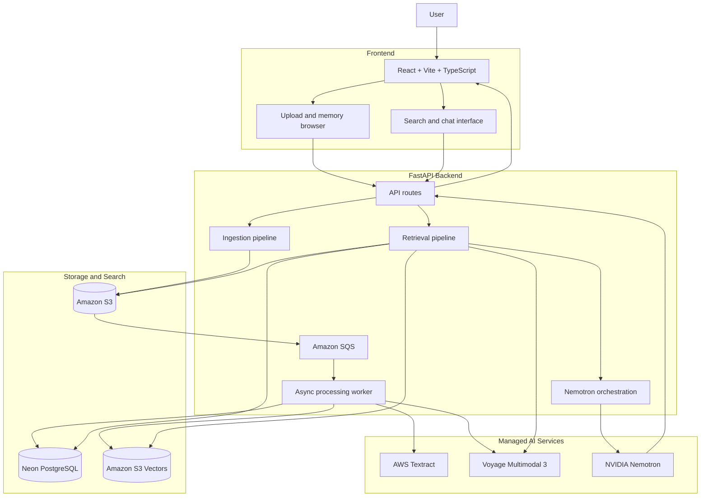
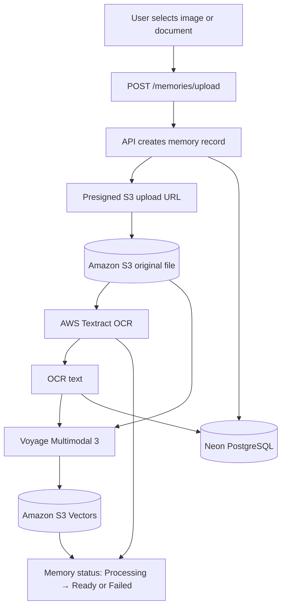
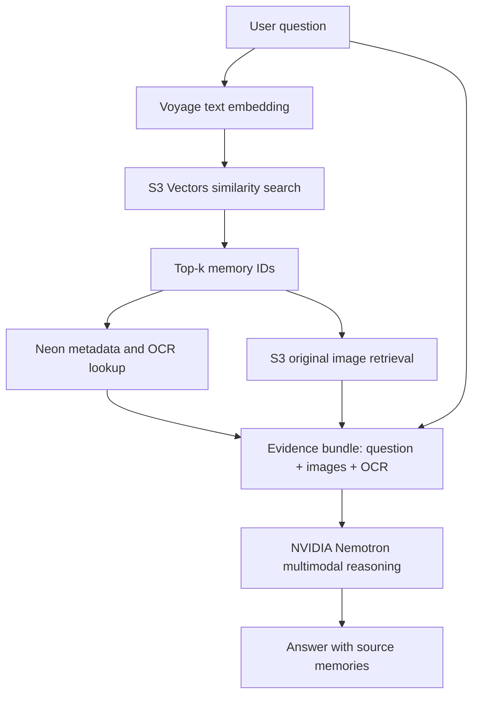

# Remora

**Your visual knowledge, always at hand.**

Remora is a visual memory engine for images and documents. Upload the things
you want to remember, then ask questions in natural language and receive
multimodal answers grounded in your own files.

## Problem

Screenshots, receipts, invoices, notes, and documents contain useful
information, but filenames and folders are poor memory systems. Conventional
search can find a keyword; it cannot reliably understand a visual document,
connect evidence across files, or explain an answer.

The information is there. The difficult part is remembering where it is and
what it means.

Remora is designed for the everyday visual archive:

- A screenshot of an error message
- A receipt or invoice needed months later
- A photo of a whiteboard or handwritten note
- A PDF or document that should be searchable by meaning
- A collection of reference images that does not have useful filenames

## Solution

Remora turns a personal collection into a queryable visual knowledge base.
It combines OCR, multimodal embeddings, vector retrieval, and multimodal
reasoning in one focused workflow:

1. **Upload** an image or document through the web UI.
2. **Understand** the file with AWS Textract and Voyage Multimodal 3.
3. **Store** the original file in S3, metadata and OCR in Neon PostgreSQL,
   and embeddings in S3 Vectors.
4. **Ask** a natural-language question about the collection.
5. **Retrieve** the most relevant memories using semantic similarity.
6. **Reason** over the retrieved images and OCR with NVIDIA Nemotron.
7. **Cite** the memories that support the answer.

The product experience is simple:

> **Upload → understand → ask → retrieve → reason → cite**

## Architecture

This is the high-level application architecture. The frontend is intentionally
thin: it handles uploads, status feedback, memory browsing, and questions.
The FastAPI backend coordinates storage, processing, retrieval, and reasoning.



The frontend handles upload, preview, status, browsing, and questions. FastAPI
coordinates the processing and query paths. S3 stores the evidence, Textract
extracts text, Neon stores metadata, S3 Vectors indexes embeddings, Voyage
creates representations, and Nemotron generates grounded answers.

## How It Works

Remora has two connected paths: an **Ingestion Pipeline** that prepares
memories for search, and a **Retrieval Pipeline** that finds and explains
relevant memories. The original file remains in S3, searchable metadata and
OCR remain in Neon, and embeddings remain in S3 Vectors.

### Ingestion Pipeline



The embedding model receives both sides of the memory:

- The original image from S3
- The OCR text extracted by Textract

This creates a shared representation for visual and text queries. The UI
shows the uploaded image immediately, then polls
`GET /memories/{memory_id}/status` until processing is complete.

#### Ingestion details

The frontend sends file metadata to the API, receives a presigned URL, and
uploads directly to S3. The processing flow extracts OCR, embeds the image and
text with Voyage, stores metadata and OCR in Neon, and indexes the embedding
in S3 Vectors. The frontend reflects `Processing`, `Ready`, or `Failed`.

### Retrieval Pipeline



#### Retrieval details

Voyage embeds the question into the shared semantic space. S3 Vectors returns
the best memory IDs, Neon hydrates metadata and OCR, and S3 provides the
original images. Nemotron receives the question, images, OCR, and source
context, then the API returns a grounded answer and source memories.

## Key Features

- **Visual memory upload** for images and supported documents.
- **Immediate optimistic preview** while a new memory is processing.
- **Processing status feedback** with explicit `Processing`, `Ready`, and
  `Failed` states.
- **Presigned S3 uploads and downloads** so file data moves directly between
  the browser and object storage.
- **OCR-aware retrieval** for receipts, screenshots, invoices, and documents.
- **Multimodal embeddings** in a shared image/text search space.
- **Natural-language questions** instead of filename-based searching.
- **Evidence-grounded answers** based on retrieved images and OCR.
- **Chat-style search interface** with recent query history.
- **API documentation** through FastAPI's local OpenAPI interface.

## Tech Stack

| Layer | Current technology |
|---|---|
| Frontend | React 18, TypeScript, Vite, Tailwind CSS, Zustand |
| API | FastAPI, Python 3.11+, Pydantic |
| HTTP client | Axios |
| Object storage | Amazon S3 |
| OCR | AWS Textract |
| Metadata and OCR database | Neon PostgreSQL |
| Vector database | Amazon S3 Vectors |
| Embeddings | Voyage Multimodal 3 (`voyage-multimodal-3`), 1024 dimensions |
| Multimodal reasoning | NVIDIA Nemotron 3 Nano Omni 30B A3B |
| Backend testing | pytest, pytest-asyncio, httpx |

## AWS / Ship It

Remora uses AWS services in the working product path, not only in a proposed
deployment diagram:

- **Amazon S3** stores original uploaded files and provides presigned upload
  and download URLs.
- **AWS Textract** extracts text from visual documents so receipts, scans, and
  screenshots become searchable.
- **Amazon S3 Vectors** stores embeddings and performs similarity retrieval.
- **AWS SDK clients** connect the FastAPI backend to these managed services.

Neon PostgreSQL, Voyage, and NVIDIA complement the AWS services:

- Neon provides durable relational metadata and OCR storage.
- Voyage provides the shared image/text embedding model.
- NVIDIA Nemotron performs the final multimodal reasoning step.

The architecture is deliberately direct: S3 stores the evidence, Textract
extracts text, S3 Vectors finds relevant memories, and Nemotron explains the
result.

## Quick Start

### Prerequisites

- Python 3.11+
- Node.js 20+
- AWS credentials with access to S3, Textract, and S3 Vectors
- A Neon PostgreSQL database
- A Voyage API key
- An NVIDIA API key for Nemotron

### Start the backend

```bash
git clone https://github.com/a-y-a-n-das/Remora.git
cd Remora/backend
python -m venv .venv
source .venv/bin/activate
pip install -e ".[dev]"

# Configure the backend environment with your service credentials.
uvicorn app.main:app --reload --port 8000
```

The API runs at `http://localhost:8000` and its interactive documentation is
available at `http://localhost:8000/docs`.

### Start the frontend

```bash
cd frontend
npm install
npm run dev
```

Open `http://localhost:5173`. Set `VITE_API_BASE_URL` when the backend runs at
a different address.

### Build and test

```bash
cd frontend
npm run build

cd ../backend
pytest -q
```

## Hackathon

**WeMakeDevs × AWS — First Commit**  
**Bharat Builds Tour · Ship It track · September 17–20, 2026**

Remora addresses a real problem: important information is trapped inside an
ever-growing visual archive. Its answer is a working, end-to-end product:

- A focused user experience for uploading and querying visual memories.
- A real ingestion path using S3, Textract, Neon, Voyage, and S3 Vectors.
- Multimodal reasoning that uses retrieved images rather than text alone.
- Visible processing states and source-grounded answers.
- A simple architecture that is understandable in a live demo.


Built by **Ayan** for the WeMakeDevs × AWS Bharat Builds hackathon.
