# REMORA

**Your visual knowledge, always at hand.**

Remora is a personal visual knowledge engine that ingests your images and documents, extracts their meaning, and lets you query them in natural language. Upload images and documents — then ask questions and get answers grounded in your own content, with citations back to the source.

---

## The Problem

Information accumulates faster than we can organize it. Photos of receipts, screenshots, documents, and notes pile up across folders, drives, and tools. When you need a specific detail later, you remember *that it exists* but not *where it is*. Traditional search finds filenames and keywords; it doesn't understand context or synthesize answers across your visual memory.

## The Solution

Remora builds a private, local-first visual knowledge base with semantic search and multimodal RAG (Retrieval-Augmented Generation):

1. **Ingest** — Upload images and documents via the web UI or API
2. **Process** — OCR extraction (Textract), multimodal embeddings (Voyage)
3. **Store** — Persist vectors in S3 Vectors, metadata in Neon PostgreSQL
4. **Query** — Ask questions in natural language
5. **Answer** — Multimodal reasoning (Nemotron) over retrieved images + OCR, grounded in your content with source citations

```mermaid
flowchart LR
    A[Upload Image] --> B[S3 Storage]
    B --> C[Textract OCR]
    C --> D[Neon: OCR + Metadata]
    D --> E[Voyage Multimodal 3.5]
    E --> F[(S3 Vectors)]
    F[User Query] --> G[Voyage Text Embedding]
    G --> H[S3 Vectors Search]
    H --> I[Top-k Memory IDs]
    I --> J[Neon: OCR + Metadata]
    J --> K[S3: Image Bytes]
    K --> L[Nemotron 3 Nano Omni]
    L --> M[Final Answer + Citations]
```



---

## Key Features

| Feature | Status | Description |
|---------|--------|-------------|
| Image/document upload (PDF, JPG, PNG, WebP) | 🟢 Implemented | Drag-and-drop UI + REST API |
| Textract OCR extraction | 🟢 Implemented | AWS Textract for text extraction |
| Multimodal embedding (Voyage 3.5) | 🟢 Implemented | 1024-dim embeddings for images + OCR |
| Vector storage (S3 Vectors) | 🟢 Implemented | Native S3 vector storage + cosine search |
| Metadata + OCR storage (Neon PostgreSQL) | 🟢 Implemented | Persistent relational storage |
| Multimodal reasoning (Nemotron 3 Nano Omni) | 🟢 Implemented | NVIDIA Nemotron 3 Nano Omni 30B A3B |
| Visual query with image citations | 🟢 Implemented | Answers grounded in retrieved images |
| Document upload (PDF) | 🟡 Planned | PDF support via Textract |
| Multi-collection organization | 🟡 Planned | Group memories by project/topic |
| Chat-style query interface | 🟢 Implemented | Conversational history per session |

> **Status legend**: 🟢 Implemented · 🟡 Planned · 🔴 Not started

---

## How It Works

### Ingestion Pipeline

```
┌─────────────┐     ┌─────────────┐     ┌─────────────┐     ┌─────────────┐
│   Upload    │────▶│  S3 Store   │────▶│  Textract   │────▶│   Neon      │
│  (API/UI)   │     │  (Original) │     │  (OCR)      │     │  (OCR+Meta) │
└─────────────┘     └─────────────┘     └─────────────┘     └──────┬──────┘
                                                                     │
                                                                     ▼
┌─────────────┐     ┌─────────────┐     ┌─────────────┐     ┌─────────────┐
│   Neon      │◀───│  Voyage     │◀───│  S3 Vectors │◀───│  Upsert     │
│  (Metadata) │     │  Multimodal │     │  (1024-D)   │     │  Vector     │
└─────────────┘     └─────────────┘     └─────────────┘     └─────────────┘
```

### Retrieval Pipeline

```
Text Query
    │
    ▼
┌─────────────────────┐
│  Voyage Text Embed  │  (Voyage Multimodal 3.5)
└──────────┬──────────┘
           │
           ▼
┌─────────────────────┐
│  S3 Vectors Search  │  → Top-k by cosine similarity
└──────────┬──────────┘
           │
           ▼
┌─────────────────────┐
│  Neon Hydration     │  → OCR + Metadata + S3 Keys
│  (Batch Lookup)     │
└──────────┬──────────┘
           │
           ▼
┌─────────────────────┐
│  S3 Image Fetch     │  → Base64 Encode
│  (Parallel)         │
└──────────┬──────────┘
           │
           ▼
┌─────────────────────┐
│  Nemotron 3 Nano    │  → Multimodal Reasoning
│  Omni 30B A3B       │     (Images + OCR + Query)
└──────────┬──────────┘
           │
           ▼
      Final Answer
```

---

## Architecture

```mermaid
flowchart TB
    subgraph Client["Frontend (React + Vite + TypeScript)"]
        UI[Upload / Chat UI]
        Auth[Auth Context]
    end

    subgraph API["Backend (FastAPI / Python)"]
        Router[API Routes]
        AuthSvc[Auth Service]
        Ingest[Ingestion Pipeline]
        Query[Query / RAG Pipeline]
        Collections[Collection Manager]
    end

    subgraph Data["Data Layer"]
        PG[(PostgreSQL + pgvector)]
        Redis[(Redis - Job Queue / Cache)]
        ObjectStore[(S3 / MinIO - Raw Files)]
    end

    subgraph AI["AI Services"]
        Embedder[Embedding Model]
        LLM[LLM (Ollama / Bedrock / OpenAI)]
        Reranker[Cross-Encoder Reranker]
    end

    UI --> Router
    Auth --> AuthSvc
    Router --> Ingest
    Router --> Query
    Router --> Collections
    Ingest --> ObjectStore
    Ingest --> Embedder
    Ingest --> PG
    Query --> Embedder
    Query --> PG
    Query --> Reranker
    Query --> LLM
    Collections --> PG
```

### Component Status

| Component | Technology | Status | Runs Locally | AWS Target |
|-----------|------------|--------|--------------|------------|
| Frontend | React 18, Vite, TypeScript, Tailwind | 🟢 Implemented | ✅ | Amplify / S3 + CloudFront |
| Backend API | FastAPI, Python 3.11+ | 🟢 Implemented | ✅ | ECS Fargate / App Runner |
| Metadata DB | Neon PostgreSQL | 🟢 Implemented | ✅ (Docker) | Neon / RDS for PostgreSQL |
| Vector Store | S3 Vectors | 🟢 Implemented | ✅ (Docker) | S3 Vectors |
| Object Storage | S3 | 🟢 Implemented | ✅ (Docker) | S3 |
| Job Queue | SQS + Lambda / Celery | 🟢 Implemented | ✅ (Docker) | SQS + ElastiCache |
| OCR | AWS Textract | 🟢 Implemented | ✅ | Textract |
| Embeddings | Voyage Multimodal 3.5 | 🟢 Implemented | ✅ | Voyage API |
| Vector Store | S3 Vectors | 🟢 Implemented | ✅ | S3 Vectors |
| Multimodal Reasoning | Nemotron 3 Nano Omni | 🟢 Implemented | ✅ | NVIDIA NIM / API |
| Auth | JWT, bcrypt | 🟢 Implemented | ✅ | Cognito (future) |

---

## AWS / Ship It

This project targets the **Ship It** track. The architecture is designed for AWS from day one.

### AWS Services (Planned / Configured)

| Service | Purpose | Why |
|---------|---------|-----|
| **ECS Fargate** | Run backend API containers | Serverless compute, no EC2 management |
| **Neon PostgreSQL** | Metadata + OCR storage | Managed, ACID, serverless, branchable |
| **S3 Vectors** | Vector storage + similarity search | Native vector search, serverless, pay-per-use |
| **S3** | Original image storage | Durable, cheap, integrates with Lambda/ECS |
| **CloudFront + S3 (or Amplify)** | Frontend hosting | Global CDN, HTTPS, custom domain |
| **Voyage API** | Multimodal embeddings | 1024-D, image+text, shared vector space |
| **NVIDIA NIM / API** | Multimodal reasoning | Nemotron 3 Nano Omni 30B A3B |
| **AWS Textract** | OCR extraction | Fully managed, high accuracy |
| **SQS** | Async ingestion queue | Decouple upload from processing |
| **Secrets Manager** | API keys, DB passwords | No secrets in code/env |
| **CloudWatch / X-Ray** | Observability | Logs, metrics, distributed tracing |

### Deployment Status

> 🚧 **NOT YET DEPLOYED** — Infrastructure as Code (Terraform/CDK) and CI/CD pipeline are **planned**. See [Deployment](#deployment) for intended process.

**Live Demo:** `[COMING SOON]`

---

## Tech Stack

| Layer | Technologies |
|-------|--------------|
| **Frontend** | React 18, TypeScript, Vite, Tailwind CSS, TanStack Query, Zustand |
| **Backend** | FastAPI, Pydantic v2, Python 3.11+, Uvicorn |
| **Vector Search** | S3 Vectors (cosine similarity) |
| **Metadata DB** | Neon PostgreSQL (serverless, serverless, branchable) |
| **Document Processing** | AWS Textract (OCR), pdfplumber, python-docx, markdown-it-py, tiktoken |
| **Embeddings** | Voyage Multimodal 3.5 (1024-D, shared image/text space) |
| **Multimodal Reasoning** | NVIDIA Nemotron 3 Nano Omni 30B A3B |
| **OCR** | AWS Textract |
| **Object Storage** | S3 (boto3) |
| **Vector Search** | S3 Vectors (cosine similarity) |
| **Task Queue** | SQS + Lambda / Celery, Redis |
| **Auth** | python-jose (JWT), passlib (bcrypt) |
| **Storage** | S3 (boto3) |
| **Observability** | structlog, prometheus-client, OpenTelemetry (planned) |
| **Infrastructure** | Docker, Docker Compose, Terraform (planned), GitHub Actions (planned) |
| **Testing** | pytest, pytest-asyncio, httpx, pytest-mock |

---

## Getting Started

### Prerequisites

- **Docker** and **Docker Compose** v2+
- **Python 3.11+** (for local development without Docker)
- **Node.js 20+** and **pnpm** (for frontend development)
- **Ollama** (optional, for local LLM) — `curl -fsSL https://ollama.ai/install.sh | sh`

### Quick Start (Docker Compose)

```bash
# Clone and enter
git clone <repo-url> remora
cd remora

# Copy environment template
cp .env.example .env
# Edit .env with your settings (see Environment Variables below)

# Start all services
docker compose up -d --build

# Frontend: http://localhost:5173
# Backend API: http://localhost:8000
# API Docs: http://localhost:8000/docs
# MinIO Console: http://localhost:9001
```

### Local Development (Without Docker)

**Backend**
```bash
cd backend
python -m venv .venv
source .venv/bin/activate
pip install -e ".[dev]"

# Start Redis & Postgres (via Docker)
docker compose up -d postgres redis minio

# Run migrations
alembic upgrade head

# Start API server
uvicorn app.main:app --reload --port 8000

# In another terminal, start Celery worker
celery -A app.workers.celery_app worker --loglevel=info
```

**Frontend**
```bash
cd frontend
pnpm install
pnpm dev  # http://localhost:5173
```

### Environment Variables

| Variable | Description | Required | Default |
|----------|-------------|----------|---------|
| `AWS_REGION` | AWS region for all services | ✅ | `us-east-1` |
| `AWS_ACCESS_KEY_ID` | AWS access key ID | ✅ | |
| `AWS_SECRET_ACCESS_KEY` | AWS secret access key | ✅ | |
| `AWS_ENDPOINT_URL` | Custom AWS endpoint (for LocalStack) | ❌ | |
| `S3_BUCKET` | S3 bucket for original images | ✅ | `remora-memory` |
| `MAX_FILE_SIZE_MB` | Max upload size | ❌ | `10` |
| `MAX_FILES_PER_REQUEST` | Max files per upload | ❌ | `5` |
| `RATE_LIMIT_UPLOADS` | Rate limit per minute | ❌ | `20` |
| `MAX_TOTAL_STORAGE_GB` | Max total storage | ❌ | `10` |
| `SQS_QUEUE_URL` | SQS queue for processing | ✅ | |
| `SQS_MAX_MESSAGES` | Max messages per poll | ❌ | `1` |
| `SQS_WAIT_TIME_SECONDS` | SQS long poll wait | ❌ | `20` |
| `SQS_VISIBILITY_TIMEOUT_SECONDS` | Visibility timeout | ❌ | `300` |
| `TEXTRACT_MAX_RETRIES` | Textract retry attempts | ❌ | `3` |
| `VOYAGE_API_KEY` | Voyage AI API key | ✅ | |
| `VOYAGE_MODEL` | Voyage model identifier | ❌ | `voyage-multimodal-3` |
| `VOYAGE_EMBEDDING_DIMENSION` | Embedding dimension | ❌ | `1024` |
| `VOYAGE_MAX_RETRIES` | Voyage API retries | ❌ | `3` |
| `VOYAGE_TIMEOUT_SECONDS` | Voyage API timeout | ❌ | `30.0` |
| `S3_VECTORS_BUCKET` | S3 Vectors bucket name | ✅ | |
| `S3_VECTORS_INDEX` | S3 Vectors index name | ❌ | `memories` |
| `S3_VECTORS_DIMENSION` | Vector dimension | ❌ | `1024` |
| `S3_VECTORS_DISTANCE_METRIC` | Distance metric | ❌ | `cosine` |
| `S3_VECTORS_MAX_RETRIES` | S3 Vectors retries | ❌ | `3` |
| `NEON_DATABASE_URL` | Neon PostgreSQL connection string | ✅ | |
| `NVIDIA_API_KEY` | NVIDIA API key | ✅ | |
| `NVIDIA_API_BASE` | NVIDIA API base URL | ❌ | `https://integrate.api.nvidia.com/v1` |
| `NEMOTRON_MODEL` | Nemotron model identifier | ❌ | `nvidia/nemotron-3-nano-omni-30b-a3b-reasoning` |
| `NEMOTRON_MAX_RETRIES` | Nemotron retries | ❌ | `3` |
| `NEMOTRON_TIMEOUT_SECONDS` | Nemotron API timeout | ❌ | `60.0` |
| `ADMIN_USERNAME` | Admin username | ❌ | `admin` |
| `ADMIN_PASSWORD` | Admin password | ✅ | |
| `ALLOWED_ORIGINS` | CORS allowed origins | ❌ | `*` |
| `LOG_LEVEL` | Log level | ❌ | `INFO` |
| `JWT_SECRET` | Secret for JWT signing | ✅ | **generate a strong random string** |
| `JWT_ALGORITHM` | JWT algorithm | ❌ | `HS256` |
| `JWT_EXPIRE_MINUTES` | Access token TTL | ❌ | `60` |

---

## Usage

### Upload a Document (API)

```bash
curl -X POST http://localhost:8000/api/v1/documents \
  -H "Authorization: Bearer <token>" \
  -F "file=@research_paper.pdf" \
  -F "collection_id=my-research"
```

### Query Your Knowledge Base

```bash
curl -X POST http://localhost:8000/api/v1/query \
  -H "Authorization: Bearer <token>" \
  -H "Content-Type: application/json" \
  -d '{
    "question": "What methodology did the paper use for evaluation?",
    "collection_id": "my-research",
    "stream": true
  }'
```

**Response (streaming):**
```json
{
  "answer": "The paper used a randomized controlled trial...",
  "citations": [
    {"doc_id": "uuid", "filename": "research_paper.pdf", "page": 3, "chunk_index": 2, "text": "We evaluated using a randomized controlled trial..."}
  ],
  "usage": {"prompt_tokens": 1240, "completion_tokens": 180}
}
```

### Web UI

1. Open `http://localhost:5173`
2. Register / log in
3. Create a collection (e.g., "Work Projects", "Research")
4. Drag and drop PDFs, Markdown, or text files
5. Wait for processing (status shows in UI)
6. Switch to **Chat** tab, select the collection, ask questions

---

## Project Structure

```
remora/
├── backend/                 # FastAPI application
│   ├── app/
│   │   ├── api/            # API routes (documents, query, collections, auth)
│   │   ├── core/           # Config, security, database, exceptions
│   │   ├── models/         # SQLAlchemy models
│   │   ├── schemas/        # Pydantic schemas (request/response)
│   │   ├── services/       # Business logic (ingestion, query, embeddings)
│   │   ├── workers/        # Celery tasks for async processing
│   │   └── main.py         # App entrypoint
│   ├── alembic/            # Database migrations
│   ├── tests/              # Backend tests (pytest)
│   ├── pyproject.toml
│   └── Dockerfile
├── frontend/               # React + Vite + TypeScript
│   ├── src/
│   │   ├── components/     # Reusable UI components
│   │   ├── pages/          # Route pages (Login, Collections, Chat, Upload)
│   │   ├── hooks/          # Custom React hooks
│   │   ├── store/          # Zustand stores (auth, collections, query)
│   │   ├── api/            # API client (TanStack Query + Axios)
│   │   └── utils/
│   ├── index.html
│   ├── package.json
│   └── Dockerfile
├── infrastructure/         # IaC (planned)
│   ├── terraform/          # AWS resources
│   └── docker-compose.yml  # Local development stack
├── scripts/                # Utility scripts (ingest, benchmark, etc.)
├── .env.example
├── docker-compose.yml      # Root compose for full stack
├── Makefile                # Common commands
└── README.md
```

---

## Deployment

### Intended AWS Deployment Process

> ⚠️ **Not yet implemented** — The following describes the target deployment flow.

1. **Infrastructure Provisioning (Terraform)**
   ```bash
   cd infrastructure/terraform
   terraform init
   terraform plan -var-file=prod.tfvars
   terraform apply -var-file=prod.tfvars
   ```
   Creates: VPC, RDS (pgvector), ElastiCache, ECS Cluster, S3 buckets, CloudFront, IAM roles, Secrets Manager entries.

2. **Container Images (GitHub Actions)**
   - On push to `main`: Build backend & frontend Docker images → push to ECR
   - Run tests, lint, type-check in pipeline

3. **Service Deployment**
   - ECS Services for backend (API + Celery worker) with Fargate
   - Frontend: Amplify (auto-deploy from `main`) or S3 + CloudFront via pipeline

4. **Database Migrations**
   - Run as ECS one-off task or via GitHub Actions step before deploy

5. **Secrets Management**
   - All secrets in AWS Secrets Manager, injected as env vars at runtime

### Local Docker Compose (Current)

```bash
# Full stack
docker compose -f infrastructure/docker-compose.yml up -d

# View logs
docker compose logs -f backend

# Stop
docker compose down -v  # -v removes volumes (data loss!)
```

---

## Hackathon

**WeMakeDevs × AWS — First Commit**  
**Bharat Builds Tour**  
**Track: Ship It** (Sep 17–20, 2026)

### How Remora Addresses the Hackathon Criteria

| Criterion | Remora's Approach |
|-----------|-------------------|
| **Real Problem** | Solves personal knowledge retrieval — a daily pain point for developers, researchers, students. Not a toy demo. |
| **AWS Integration** | Architected for managed AWS services (RDS pgvector, Bedrock, ECS, S3, ElastiCache). No "AWS-washing" — each service has a clear role. |
| **Execution** | Working local stack (Docker Compose), clean separation of concerns, typed APIs, async processing, streaming responses. |
| **Learning** | Building RAG from scratch: chunking strategies, embedding models, reranking, prompt engineering, vector DB tuning, production Docker/ECS patterns. |

> This project is being developed *for* the hackathon. No awards, rankings, or judging outcomes are claimed.

---

## Roadmap

| Phase | Items |
|-------|-------|
| **MVP (Hackathon)** | Document upload → processing → chat query with citations; local Docker stack; deploy to AWS (ECS + RDS + Bedrock) |
| **Post-Hackathon v0.2** | Multi-user with Cognito; collection sharing; Obsidian/Notion import; hybrid keyword+vector search |
| **v0.3** | Agentic RAC (multi-hop reasoning); automatic graph extraction; Slack/Discord bot; browser extension |
| **v1.0** | Plugin system; fine-tuned embeddings for domain-specific corpora; on-prem air-gapped deployment guide |

---

## License

**Licensing decision pending.**  
No license file exists in the repository yet. A license (likely MIT or Apache-2.0) will be added before the hackathon submission deadline.

---

## Author / Credits

Developed for the **WeMakeDevs × AWS First Commit hackathon** by:

- **Ayandas** — [GitHub](https://github.com/ayandas)

*No other contributors at this time.*